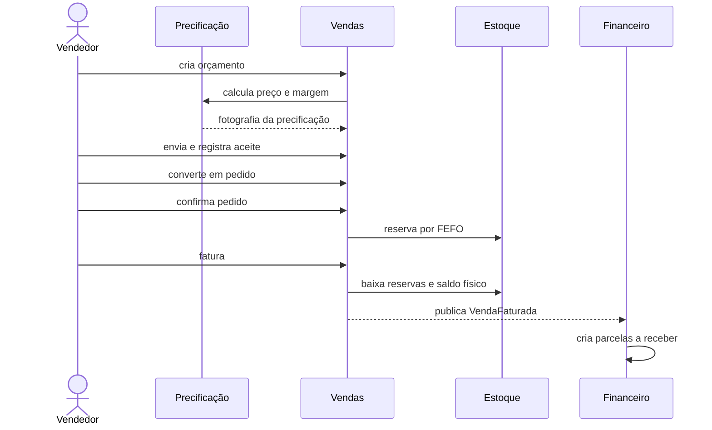
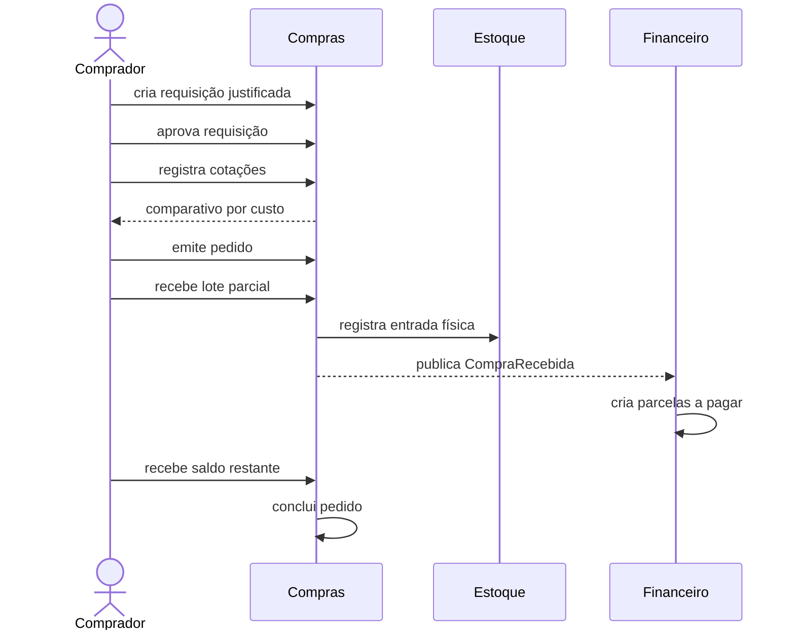

# Arquitetura da Gestão Comercial

## Visão geral

A Gestão Comercial é um monólito modular orientado a capacidades de negócio. A aplicação é implantada como uma unidade, mas os módulos possuem contratos, dados e dependências explícitos. Essa escolha preserva transações locais e simplicidade operacional sem transformar o código em um monólito sem limites.

## Contextos

| Módulo | Responsabilidade | Dependências permitidas |
|---|---|---|
| `organization` | empresa, filial e autorização por filial | `shared` |
| `partner` | cliente e fornecedor | `shared` |
| `catalog` | categoria, produto e SKU | `shared` |
| `pricing` | tabela de preço, promoção e simulação | `shared`, `catalog`, `organization` |
| `inventory` | depósito, saldo, reserva e razão físico | `shared`, `catalog`, `organization` |
| `sales` | orçamento, pedido e faturamento | `shared`, `organization`, `partner`, `catalog`, `pricing`, `inventory` |
| `purchasing` | requisição, cotação, pedido e recebimento | `shared`, `organization`, `partner`, `catalog`, `inventory` |
| `finance` | títulos, liquidações, estornos e caixa | `shared`, `organization`, eventos de `sales` e `purchasing` |
| `reporting` | projeções gerenciais de leitura | `organization`, `shared` |
| `platform` | auditoria HTTP | `shared` |

O teste `ArchitectureTest` usa Spring Modulith e ArchUnit para rejeitar ciclos, dependências não declaradas e acesso externo a pacotes `internal`.

## Fluxo de venda

## Fluxo de compra

## Consistência

- Cada caso de uso mutável executa em uma transação local.
- Eventos intermodulares são persistidos pelo registro transacional do Spring Modulith.
- Consumidores financeiros guardam o identificador do evento processado.
- Recebimentos, liquidações e estornos usam uma chave idempotente única.
- Reservas e saldos de estoque são bloqueados durante alterações concorrentes.
- Valores parcelados são convertidos em centavos, distribuindo o resto sem perda.
- Documentos de origem ligam estoque e financeiro ao pedido ou recebimento.

## Persistência

O PostgreSQL é o sistema de registro. O esquema nasce exclusivamente pelas migrações Flyway:

1. fundação, organizações, parceiros e catálogo;
2. precificação e estoque;
3. vendas;
4. financeiro e publicações de eventos;
5. compras;
6. auditoria e proteção contra alteração.

Entidades JPA não criam nem modificam o esquema (`ddl-auto: validate`). Relatórios usam projeções SQL de leitura para não acoplar o módulo a entidades dos contextos operacionais.

## Segurança

O Keycloak emite JWT com papéis de domínio e a lista de filiais autorizadas. O resource server valida assinatura, emissor e audiência. `@PreAuthorize` protege capacidades; `BranchAccessService` impede acesso cruzado entre filiais mesmo quando o usuário possui o papel funcional.

## Observabilidade

- `X-Correlation-ID` é preservado ou criado em toda requisição.
- Actuator publica saúde, métricas, Prometheus e visão dos módulos.
- Prometheus coleta a API e o Grafana recebe dashboard provisionado.
- A auditoria registra ator, método, caminho, status, IP, empresa e correlação.

## Implantação

O artefato é uma imagem multi-stage executada por usuário sem privilégios. O `compose.yaml` oferece um ambiente demonstrável completo. Em produção, segredos devem vir de um cofre, TLS deve terminar no gateway e PostgreSQL, Keycloak e observabilidade devem usar serviços gerenciados ou volumes com política de backup.
