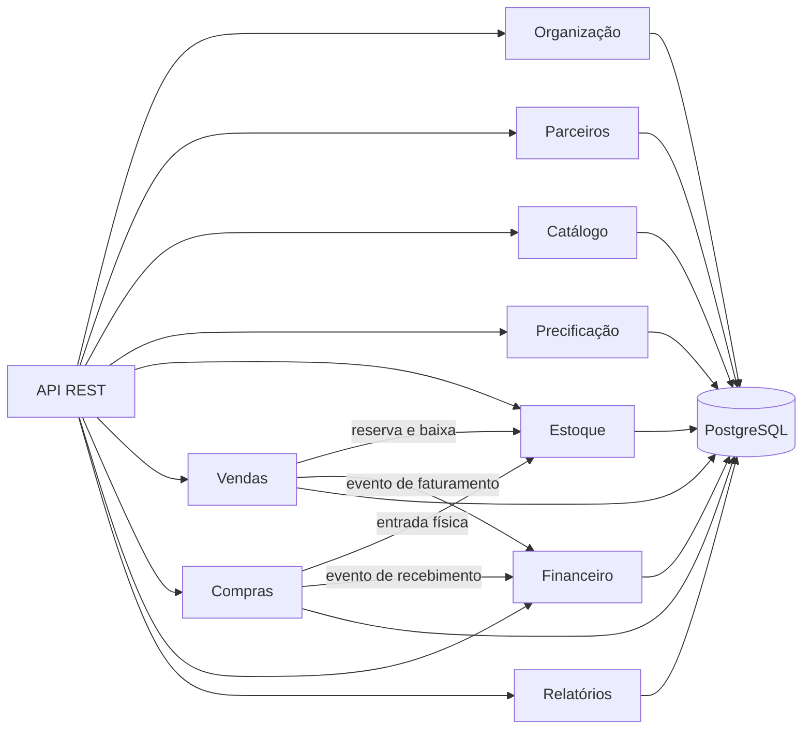

# CommerceCore

[](https://github.com/Mateusmith/commercecore/actions/workflows/ci.yml)
[](https://openjdk.org/projects/jdk/21/)
[](https://spring.io/projects/spring-boot)
[](LICENSE)

ERP comercial multiempresa construído como monólito modular. O projeto integra catálogo, precificação, vendas, compras, estoque e financeiro em fluxos transacionais completos, com segurança por JWT, idempotência, auditoria e observabilidade.

O CommerceCore não é apenas um CRUD: ele preserva invariantes entre módulos. Uma venda reserva e baixa estoque, gera parcelas exatas a receber e registra auditoria. Um recebimento parcial de compra atualiza o saldo físico, mantém o pedido aberto e cria contas a pagar sem duplicidade.

## Problema resolvido

Operações comerciais costumam ficar espalhadas entre planilhas e sistemas sem consistência. O CommerceCore centraliza o ciclo operacional e mantém rastreabilidade entre o documento de origem, os movimentos de estoque e os lançamentos financeiros.

Principais capacidades:

- organizações multiempresa e filiais com isolamento por contexto;
- parceiros que podem atuar como cliente, fornecedor ou ambos;
- produtos com SKUs, unidades, lotes, validade e estoque mínimo;
- tabelas de preço por vigência e filial, promoções e cupons;
- explicação do preço aplicado, desconto e margem;
- orçamento, aceite, pedido, reserva FEFO, faturamento e cancelamento;
- requisição, aprovação, cotação, comparativo, pedido e recebimento parcial;
- contas a receber e pagar com parcelamento exato em centavos;
- liquidações parciais, estornos e razão financeiro imutável;
- idempotência em recebimentos, pagamentos e estornos;
- relatórios gerenciais, reposição, inadimplência e exportação XLSX;
- auditoria imutável no banco, correlação de requisições e métricas.

## Arquitetura

O sistema usa **Spring Modulith** para aplicar limites verificáveis entre os módulos de um monólito modular. Entidades e repositórios ficam em pacotes `internal`; os demais módulos consomem contratos públicos, comandos e eventos.



Detalhes, dependências e invariantes estão em [ARCHITECTURE.md](ARCHITECTURE.md). As decisões relevantes estão registradas em [docs/adr](docs/adr).

## Tecnologias

- Java 21 e Maven Wrapper
- Spring Boot 4, Spring Web MVC, Validation e Data JPA
- Spring Modulith com registro transacional de eventos
- Spring Security Resource Server, OAuth2 e JWT
- Keycloak 26 com RBAC e escopo de filial
- PostgreSQL 17 e Flyway
- Apache POI para XLSX
- Actuator, Micrometer, Prometheus e Grafana
- JUnit 5, Mockito, ArchUnit, Testcontainers e JaCoCo
- Docker e Docker Compose
- OpenAPI 3 e Swagger UI

## Executar localmente

Pré-requisito: Docker Desktop em execução.

```powershell
git clone https://github.com/Mateusmith/commercecore.git
cd commercecore
docker compose up -d --build
docker compose ps
```

Na primeira execução, aguarde a API ficar `healthy`. O perfil `demo` aplica as seis migrações e carrega uma empresa, filial, parceiros, produto, estoque, preços e conta financeira de exemplo.

### Serviços

| Serviço | Endereço | Credenciais de demonstração |
|---|---|---|
| API | http://localhost:8082 | JWT obrigatório nas rotas de negócio |
| Swagger UI | http://localhost:8082/swagger-ui.html | Use `Authorize` com o token |
| OpenAPI | http://localhost:8082/v3/api-docs | JSON público |
| Keycloak | http://localhost:18083 | `admin` / `admin` |
| pgAdmin | http://localhost:15053 | `admin@commercecore.dev` / `CommerceCore@123` |
| Prometheus | http://localhost:19092 | interface sem autenticação no ambiente demo; coleta protegida por credencial técnica |
| Grafana | http://localhost:13002 | `admin` / `admin` |

### Banco de dados

| Campo | Valor local |
|---|---|
| Host | `localhost` |
| Porta | `54325` |
| Banco | `commercecore` |
| Usuário | `commercecore` |
| Senha | `commercecore` |

No pgAdmin, o servidor já vem cadastrado. A senha do PostgreSQL é solicitada na primeira conexão.

### Usuários de demonstração

Todos usam a senha `CommerceCore@123`.

| Usuário | Papéis principais |
|---|---|
| `admin@commercecore.local` | administrador |
| `vendedor@commercecore.local` | vendas, gerência comercial e faturamento |
| `comprador@commercecore.local` | compras e gerência de compras |
| `estoque@commercecore.local` | estoque e gerência de estoque |
| `financeiro@commercecore.local` | financeiro e gerência financeira |
| `auditor@commercecore.local` | auditoria e consultas |

As credenciais são exclusivamente locais e nunca devem ser usadas em produção.

## Testar a API

A forma mais rápida é importar no Postman:

1. [CommerceCore.postman_collection.json](postman/CommerceCore.postman_collection.json)
2. [Local.postman_environment.json](postman/Local.postman_environment.json)
3. Selecione o ambiente `CommerceCore - Local`.
4. Execute a coleção completa. O primeiro request obtém e armazena o JWT.

Todos os corpos JSON, a ordem dos fluxos e exemplos de erro estão em [docs/API_EXAMPLES.md](docs/API_EXAMPLES.md).

Para executar os mesmos 28 contratos automaticamente com Newman:

```powershell
docker run --rm --network commercecore_default `
  -v "${PWD}/postman:/etc/newman" postman/newman:alpine `
  run /etc/newman/CommerceCore.postman_collection.json `
  -e /etc/newman/Local.postman_environment.json `
  --env-var base_url=http://api:8082 `
  --env-var keycloak_url=http://keycloak:8080
```

O cenário automatizado percorre venda, recebimento, compra, pagamento, conciliação, relatório e auditoria:

```powershell
powershell -ExecutionPolicy Bypass -File .\scripts\smoke-test.ps1
```

## Testes automatizados

```powershell
.\mvnw.cmd verify
```

Sem Java local, o mesmo build pode ser executado em um container Maven:

```powershell
docker run --rm `
  -e TESTCONTAINERS_HOST_OVERRIDE=host.docker.internal `
  -v /var/run/docker.sock:/var/run/docker.sock `
  -v commercecore-maven:/root/.m2 `
  -v "${PWD}:/workspace" -w /workspace `
  maven:3.9.11-eclipse-temurin-21 mvn -B verify
```

A suíte cobre regras monetárias, documentos, estoque, estados de pedido, arquitetura modular, migrações e invariantes reais no PostgreSQL. Consulte [docs/TESTING.md](docs/TESTING.md).

## API

| Contexto | Prefixo |
|---|---|
| Empresas e filiais | `/api/v1/empresas` |
| Parceiros | `/api/v1/parceiros` |
| Catálogo | `/api/v1/catalogo` |
| Precificação | `/api/v1/precificacao` |
| Estoque | `/api/v1/estoque` |
| Vendas | `/api/v1/vendas` |
| Compras | `/api/v1/compras` |
| Financeiro | `/api/v1/financeiro` |
| Relatórios | `/api/v1/relatorios` |
| Auditoria | `/api/v1/auditoria` |

As chamadas autenticadas devem enviar `Authorization: Bearer <token>`, `X-Empresa-ID` e `X-Filial-ID`. Operações sensíveis repetíveis também exigem `Idempotency-Key`.

## Estrutura

```text
src/main/java/br/com/commercecore/
|-- organization/   empresas, filiais e acesso
|-- partner/        clientes e fornecedores
|-- catalog/        produtos e SKUs
|-- pricing/        preços, promoções e margem
|-- inventory/      saldos, reservas e movimentos
|-- sales/          orçamento, pedido e fatura
|-- purchasing/     requisição, cotação e recebimento
|-- finance/        títulos, liquidações e caixa
|-- reporting/      consultas gerenciais e XLSX
|-- platform/       auditoria HTTP
`-- shared/         tipos e tratamento transversal
```

## Qualidade e segurança

- valores monetários usam `BigDecimal` e tipo `Dinheiro`;
- concorrência de estoque usa bloqueio transacional e ordenação FEFO;
- movimentos físicos e financeiros nunca são sobrescritos;
- validações de estado impedem transições inválidas;
- o banco reforça a imutabilidade da auditoria por gatilho;
- consultas são paginadas e falhas seguem `Problem Details`;
- o contexto de filial é validado contra claims do token;
- CI executa testes unitários, integração PostgreSQL e verificação modular.

Consulte [SECURITY.md](SECURITY.md) para relatar vulnerabilidades e [CONTRIBUTING.md](CONTRIBUTING.md) para contribuir.

## Licença

Distribuído sob a licença [MIT](LICENSE).
